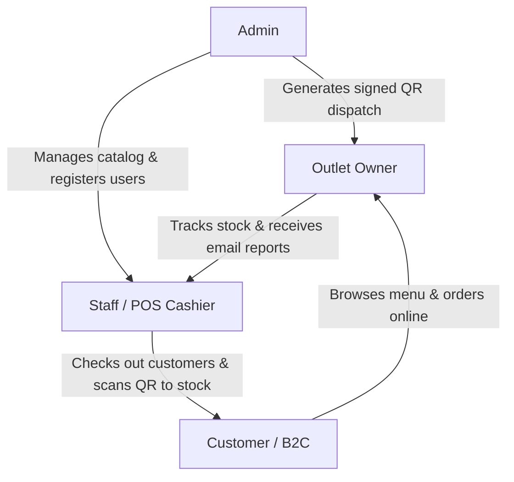

# 🍛 FlavorFlow ERP Platform

[](https://reactjs.org/)
[-000000?style=for-the-badge&logo=flask&logoColor=white)](https://flask.palletsprojects.com/)
[](https://www.sqlalchemy.org/)
[](https://www.mysql.com/)

FlavorFlow is a modern, responsive, and unified food enterprise platform designed to manage the end-to-end flow of homemade foods and retail snack supply chain networks. It integrates e-commerce B2C ordering, interactive POS (Point of Sale) cashier terminals, B2B supplier management, automated email digests, and secure, cryptographically signed QR-based stock dispatch labels.

---

## 📂 Repository Structure

```directory
food/
├── backend/                  # Flask REST API
│   ├── app.py                # Main server entrypoint
│   ├── models.py             # SQLAlchemy Database Models
│   ├── run_migrate.py        # Schema migration orchestrator (Recommended)
│   ├── migrate.py            # Legacy database migration script
│   └── requirements.txt      # Python dependencies
├── frontend/                 # React (Vite) Single Page Application
│   ├── src/                  # React source files
│   │   ├── components/       # Reusable UI elements (POS, checkout, etc.)
│   │   └── main.jsx          # Vite entrypoint
│   ├── package.json          # Node dependencies
│   └── vite.config.js        # Vite configurations
└── README.md                 # Project documentation
```

---

## ⚙️ Technical Architecture

* **Backend**: Flask (Python) with SQLAlchemy (configured for MySQL in production, with SQLite fallback for local development).
* **Frontend**: React (Vite) styled with a high-end, glassmorphic saffron/orange visual theme.
* **Database Compatibility**: SQLite (development) and MySQL (production).

---

## 👥 Role Hierarchy & Workflows



1. **Admin**
   * Manages menu catalog (Add/Edit/Delete products).
   * Registers retail outlets and user accounts.
   * Generates secure, cryptographically signed QR Dispatch labels for restocking.
   * Views audit logs, order queues, B2B purchase drafts, and sales analytics.
2. **Outlet Owner**
   * Manages specific outlets assigned to their profile.
   * Tracks real-time stock levels, low-stock notifications, and inventory parameters.
   * Receives daily automated HTML email digests of performance reports.
3. **Staff (POS Cashier)**
   * Runs checkout operations at physical retail counters (POS terminal).
   * Supports Cash and **interactive UPI Scan-to-Pay** (scannable QR billing).
   * Generates EOD Shift Reports and logs damage/spoilage write-offs.
   * Scans QR Dispatch labels on package arrival to auto-replenish stock.
   * *Note: Staff accounts must be assigned to an outlet by the Admin to launch the terminal.*
4. **Customer (B2C)**
   * Browses the digital home-food menu, manages delivery addresses.
   * Places orders, tracks delivery status in real-time, confirms delivery, downloads invoices, and submits ratings/reviews.
   * Receives automated order updates (Welcome, Placed, Shipped) via HTML emails.

---

## 🚀 Getting Started

### 1. Database Migrations
FlavorFlow contains an inspector-based, database-agnostic migration script `run_migrate.py` in the `backend/` folder:

> [!IMPORTANT]
> **Use `run_migrate.py`:**
> `run_migrate.py` dynamically inspects existing table columns and runs appropriate schema migrations for both SQLite and MySQL. Legacy raw-SQL scripts or `migrate.py` are deprecated.
> 
> Execute migrations from the `backend/` directory:
> ```bash
> cd backend
> python run_migrate.py
> ```

### 2. Backend Setup
1. Navigate to the `backend/` directory:
   ```bash
   cd backend
   ```
2. Configure environment variables in `.env` (SMTP credentials, database connections, and Flask configuration).
3. Install dependencies:
   ```bash
   pip install -r requirements.txt
   ```
4. Start the Flask application:
   ```bash
   python app.py
   ```
   * Flask runs on `http://localhost:5000`.

### 3. Frontend Setup
1. Navigate to the `frontend/` directory:
   ```bash
   cd ../frontend
   ```
2. Install Node packages:
   ```bash
   npm install
   ```
3. Run the development server:
   ```bash
   npm run dev
   ```
   * Vite dev server runs on `http://localhost:5173`.
4. Production build:
   ```bash
   npm run build
   ```
   * Serve the static files from the `dist/` directory using Nginx or a static hosting service.

---

## 🔒 Advanced Features & Security Safeguards

### A. Cryptographically Signed QR Labels
To prevent users or cashiers from forging dispatch labels (e.g., creating fake labels to increase store stock arbitrarily), generated QR codes are signed using **HMAC SHA256** checksums tied to the system `SECRET_KEY`. The backend validates the signature during POS scanning before committing any stock changes.

### B. Interactive POS UPI Checkout
When selecting the **UPI** payment method in the cashier POS terminal, the app opens a **Scan to Pay** overlay. This displays a dynamically generated merchant UPI deep-link QR code with pre-filled payment amounts. Cashiers verify payment success and confirm to complete the sale.

### C. Warm HTML Email Pipelines
The app sends responsive, warm-branded HTML emails with inline styles:
* **Customer Welcome**: Sent upon sign-up.
* **Order Confirmation**: Sent upon B2C checkout with full transaction receipt tables.
* **Shipment Tracking**: Sent when orders are marked shipped with tracking codes.
* **Staff Onboarding**: Sent to cashiers with assigned store info and login details.
* **Daily Digest**: Scheduled report emailed to the admin and registered outlet owners at 22:00 IST.

---

## 📋 Production Deployment Checklist

Before deploying this application to production, ensure you complete the following steps:

- [ ] **FLASK_ENV**: Set `FLASK_ENV=production` in the backend `.env` file.
- [ ] **Secrets**: Change default `SECRET_KEY` and `JWT_SECRET_KEY` to secure, random values.
- [ ] **Passwords**: Change the default admin password (`admin/admin`) and demo accounts. Remove the demo quick-login buttons from `Login.jsx` to prevent unauthorized access.
- [ ] **Mail Server**: Configure SMTP parameters in `.env` with a real SMTP provider (e.g., Gmail App Password) to allow notifications to send successfully.
- [ ] **SSL (HTTPS)**: Set up SSL on your server. The QR scanner uses the browser's camera API, which is blocked by modern web browsers on non-HTTPS origins.
